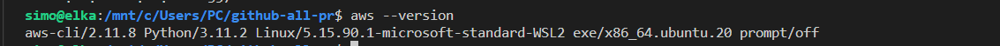

## Install AWS CLI

```sh
sudo apt update
sudo apt install awscli -y
```

Verify the installation

```sh
aws --version
```



## Install ECS CLI


```sh
sudo curl -Lo /usr/local/bin/ecs-cli https://amazon-ecs-cli.s3.amazonaws.com/ecs-cli-linux-amd64-latest
sudo chmod +x /usr/local/bin/ecs-cli
```

Verify the installation


## Running the isntallation script


```sh
sudo chmod +x aws.sh
```
