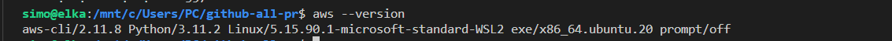
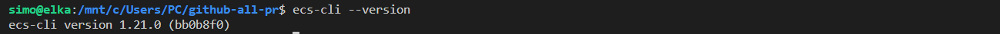

## Install AWS CLI

```sh
sudo apt update
sudo apt install awscli -y
```

Verify the installation

```sh
aws --version
```



## Install ECS CLI


```sh
sudo curl -Lo /usr/local/bin/ecs-cli https://amazon-ecs-cli.s3.amazonaws.com/ecs-cli-linux-amd64-latest
sudo chmod +x /usr/local/bin/ecs-cli
```

Verify the installation




## Running the installation script


```sh
curl -L -o aws_ecs_clis.sh https://raw.githubusercontent.com/colossus06/aws/master/aws/aws-ecs-cli/aws_ecs_clis.sh
```

```sh
sudo chmod +x aws.sh
```

```sh
./aws_ecs_clis.sh
```


🔚
