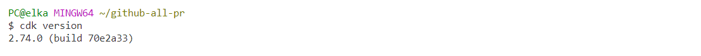
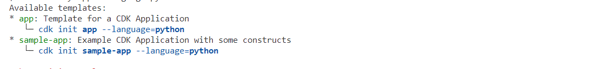
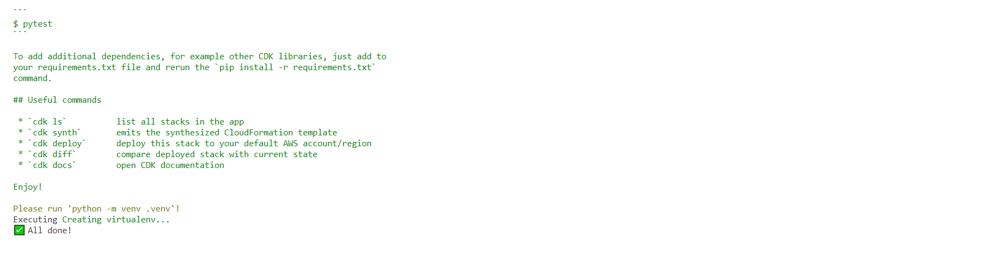
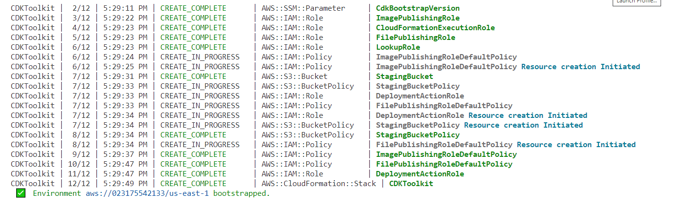
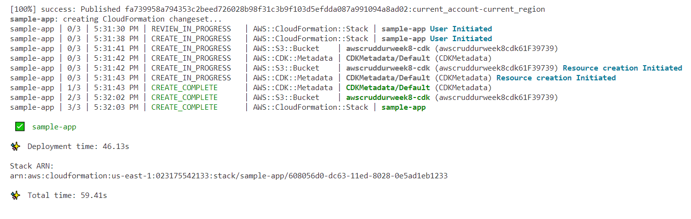
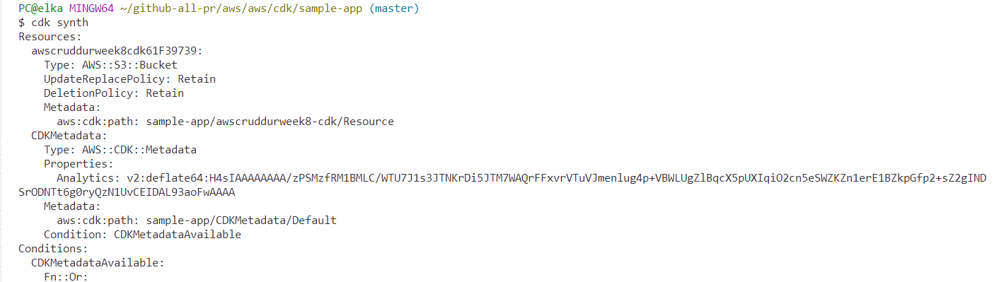
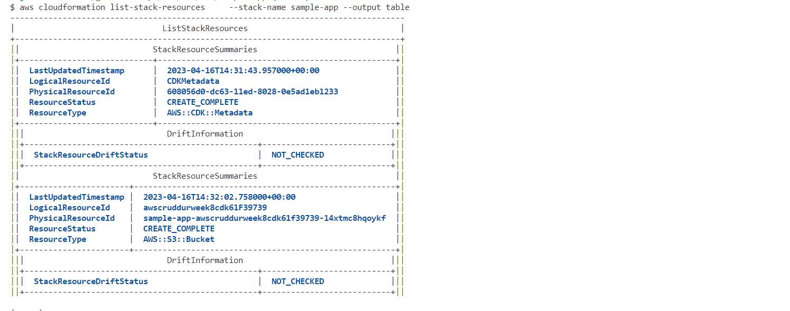
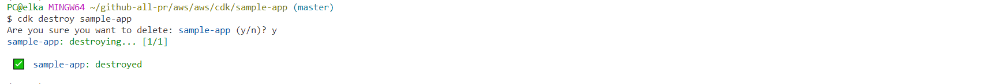

# Hands-on with CDK- Create an s3 Bucket

```sh
mkdir sample-app
```

```sh
cd sample-app
```

You can install cdk globally if you don't want to use an environment

```sh
npm install aws-cdk -g
```

```sh
cdk version
```



initialize a sample app using python 

```sh
cdk init sample-app --language python
```







Activate env for windows:

```sh
source .venv/Scripts/activate
```

Install the requirements:

```sh
pip install -r requirements.txt
```

Compile the code into cloudformation so we can get a preview of what we are going to deploy:


```sh
cdk synth
```

Bootstrap the environment to AWS:

```sh
cdk bootstrap
```




Then deploy:

```sh
cdk deploy
```







```sh
cdk list
```

Display resources in our stack

```sh
aws cloudformation list-stack-resources     --stack-name sample-app --output table
```



Destroy everyhting in our stack:

```sh
cdk destroy sample-app
```



## Useful commands:

  * `cdk list` : Lists all stacks in the app
  * `cdk synthesize`: Synthesizes and prints the CloudFormation template for this stack
  * `cdk bootstrap` : Deploys the CDK toolkit stack into an AWS environment
  * `cdk deploy`: Deploys the stack(s) named STACKS into your AWS account
  * `cdk import`: Import existing resource(s) into the given stack
  * `cdk destroy`: Destroy the stack(s) named STACKS
  * `cdk diff`: Compares the specified stack with the deployed stack or a local template file, and returns with status 1 if any difference is found


  ### Useful Resources:

  https://pypi.org/project/aws-cdk.aws-s3/