# Create a CRUD Serverless API using AWS Lambda, API Gateway and DynamoDB

In this project I builded CRUD Serverless API with AWS services Lambda, Api Gateway and Dynamodb. I made calls with Postman to the API through an invoke url (basically an HTTPS endpoint). 

I created an iam role for lambda to access CloudWatch Logs and Dynamodb. 

With each get, post, patch, delete calls Amazon API Gateway invoked the Lambda function I wrote using python. 

그럼 시작하겠습니다! ✈

## Problem statement

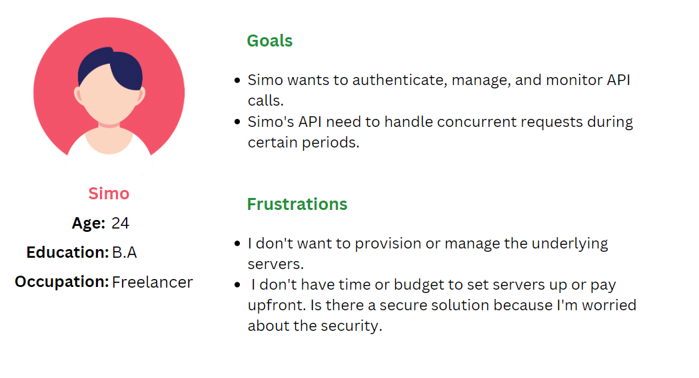

## Solution: Serverless Api

We can use AWS Api Gateway for authentication and monitoring. We can integrate cognito with lambda to address to Simo's security and authentication considerations. We can use lambda for horizontal scaling. When Simo's functions get more calls, Lambda can automatically handle scaling the number of execution environments. Simo can also optimize cost with lambda since he will be charged only for the reserved memory and time of execution of the function.

## High Level Design of the project

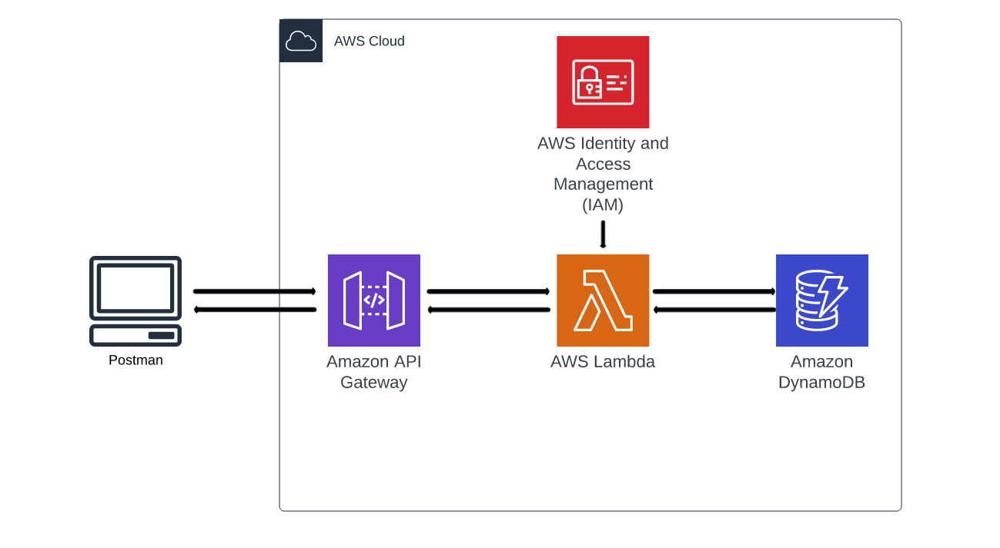

## Database Creation (DynamoDB)


I started by creating a dynamodb table to host our data for the cloud api.Created a table and gave a name `product-inventory` and then for the partition key i used `productId`. Lastly, for the data type i selected `string`

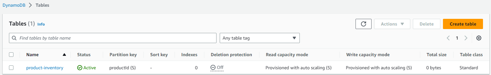

## Lambda Function Creation

I needed to create a lambda function for our api so started with creating an IAM role so that the lambda function could use it to access our dynamodb table.


First, creted the trust policy for the role( it will allow the lambda service to assume the role).

Below is the contents of the trust-policy.json:

```json
{
  "Version": "2012-10-17",
  "Statement": [
    {
      "Effect": "Allow",
      "Principal": {
        "Service": "lambda.amazonaws.com"
      },
      "Action": "sts:AssumeRole"
    }
  ]
}
```

Then created a role for the lambda function:

`aws iam create-role --role-name lambda-api-role --assume-role-policy-document file://trust-policy.json`

And noted down the `role arn` to use in creation of lambda function. Attached the policy to the role i created 

I attached two policies to it:

* CloudWatch log permission to be able to look at logs for the api requests. Role name is `AWSLambdaBasicExecutionRole`.

`aws iam attach-role-policy --role-name lambda-api-role --policy-arn arn:aws:iam::aws:policy/service-role/AWSLambdaBasicExecutionRole
`
* DynamoDb full access for crud operations.

`aws iam attach-role-policy --role-name lambda-api-role --policy-arn arn:aws:iam::aws:policy/AmazonDynamoDBFullAccess`


Next created a lambda funcion named `serverless-api-lambda`. Changed the memory to 500 and the timeout to 1 minute.

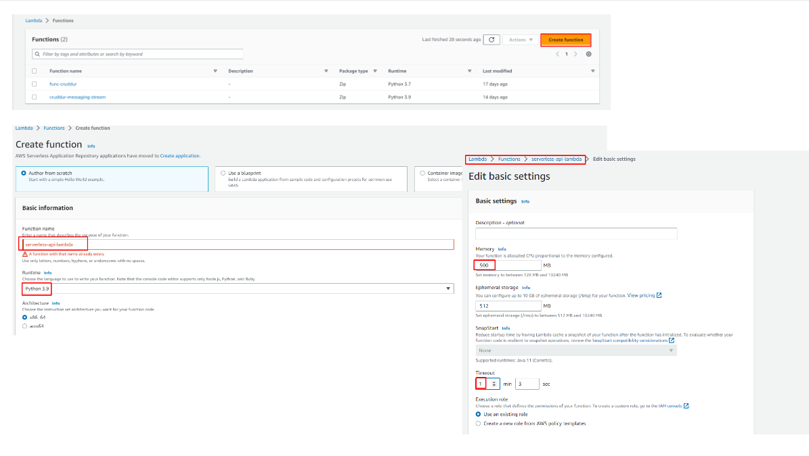

Then created 3 resources as shown in the following image. Added a get method on the health-check of which main purpose is to determine whether the api is healthy.


Repeated adding `get` step for product and `products`. Additionally, I configured the following for `product`
* `post` to insert into dynamodb.
* `patch` to update the db
* `delete` 

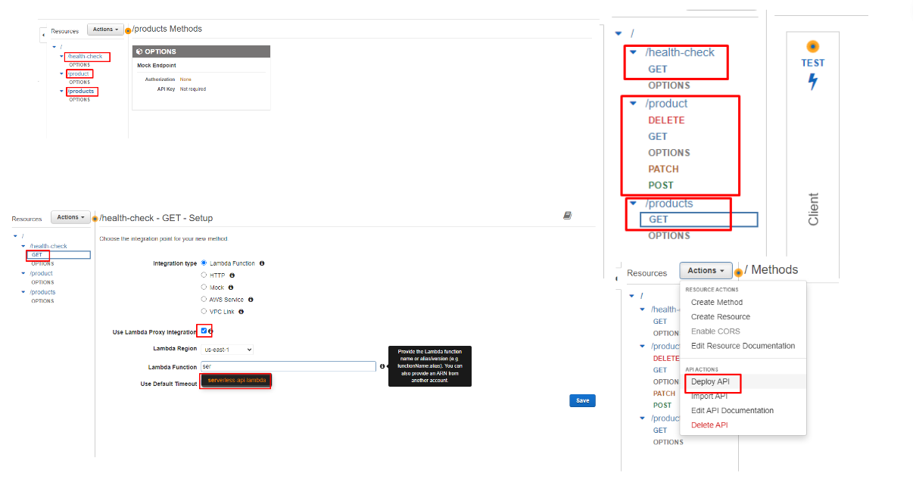

Then I activated the api by deploying the api. For this project I didn't work on auth so the api was open to the world following the invoke url. 

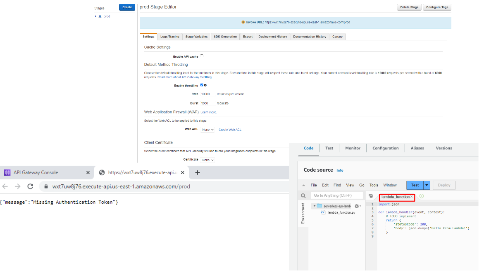

## Writing the lambda handler function


I created a .py file named `lambda_function` since it was so called by our lambda. Also created a custom encoder file to be able to support dynamodb objects. Copied the contents of them to lambda and deployed. 

Headed over to the dynamodb to verify that there is no item in the table.

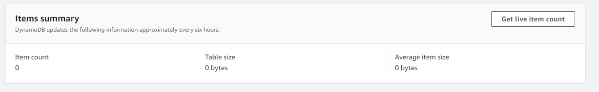

Opened up postman and pasted the invoke URL. Sent a get request on /health-check endpoint.

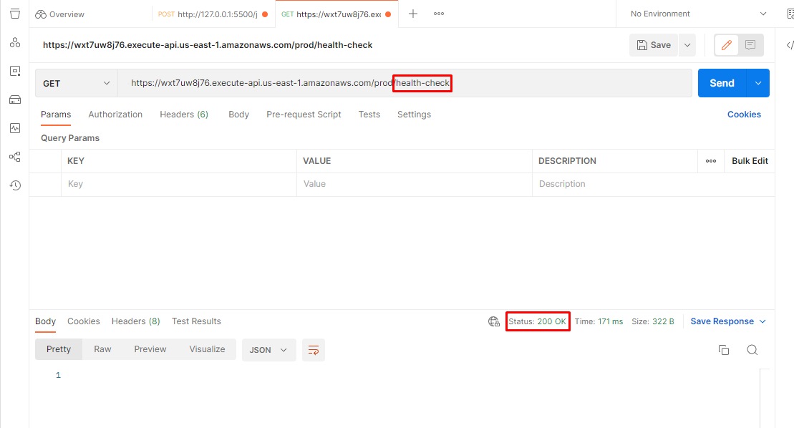

## Verifying that the API is functioning


**health check**

I could get a successful connection.

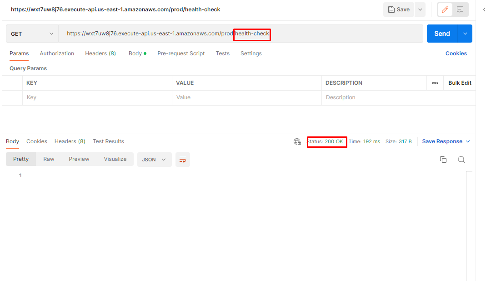

I also checked cloudwatch logs.

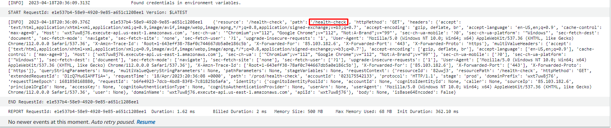

**create**

Then tried to insert a product to our dynamodb product table

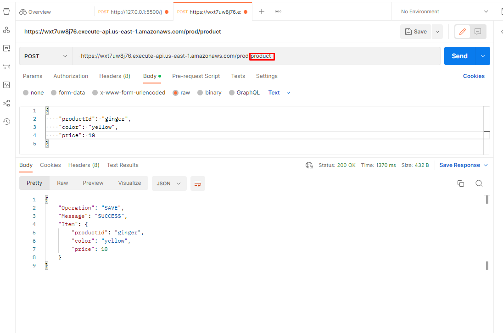

And enother one. Then verified the items on the UI if they match the ones i submitted.

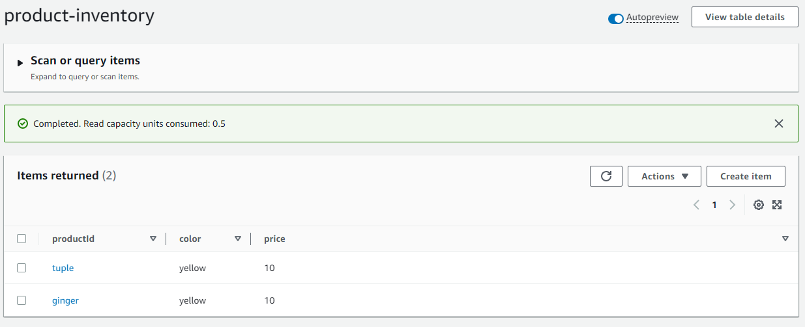

**get**

I tried to get a non-existent value and got "Message": "ProductId: 10 not found!" error.

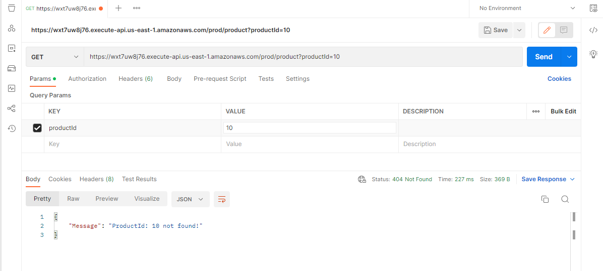

Then tried to get an item:

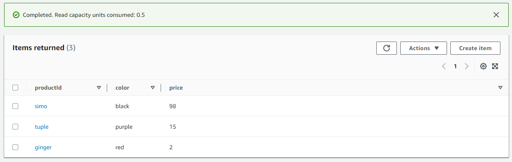

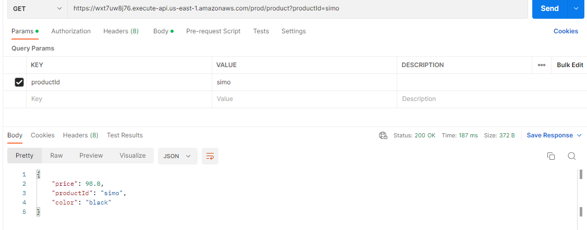


**update**

I changed the color attribute of the productId `simo` using a patch method.

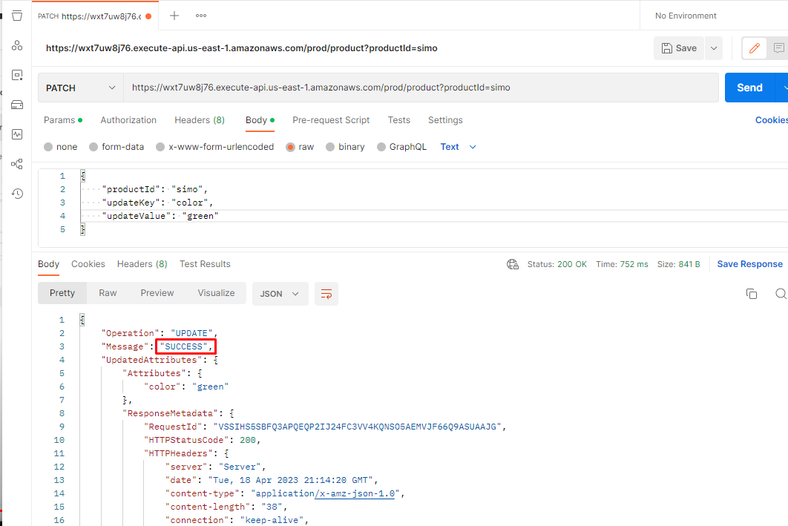

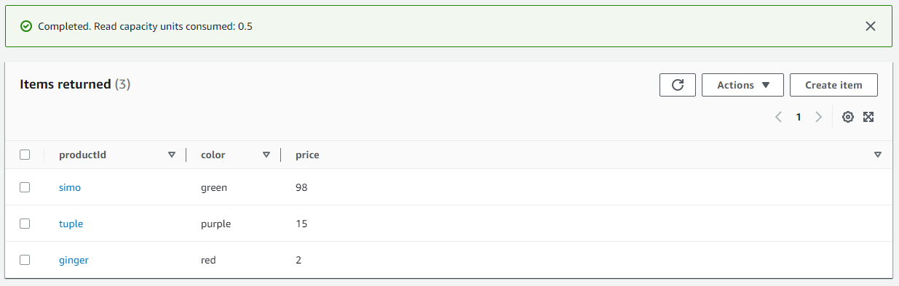

**delete**

I deleted productId `simo` from the table.

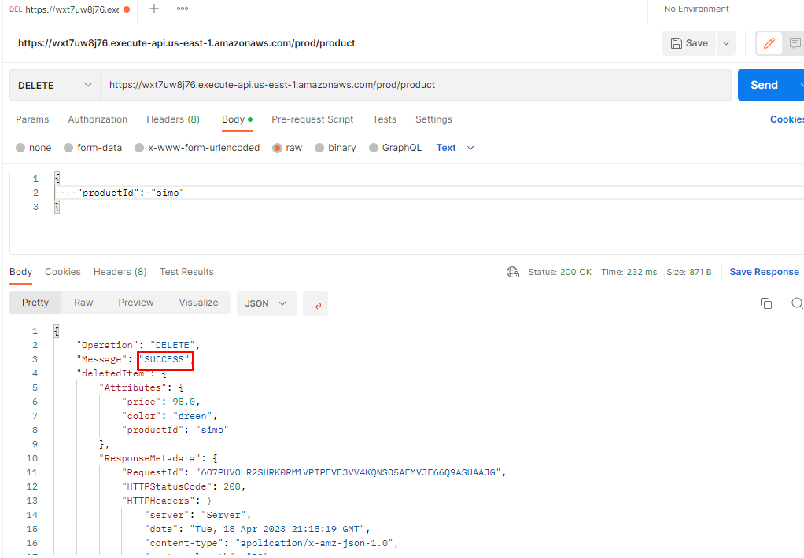

**return all items**

Lastly, displayed all items in the database:

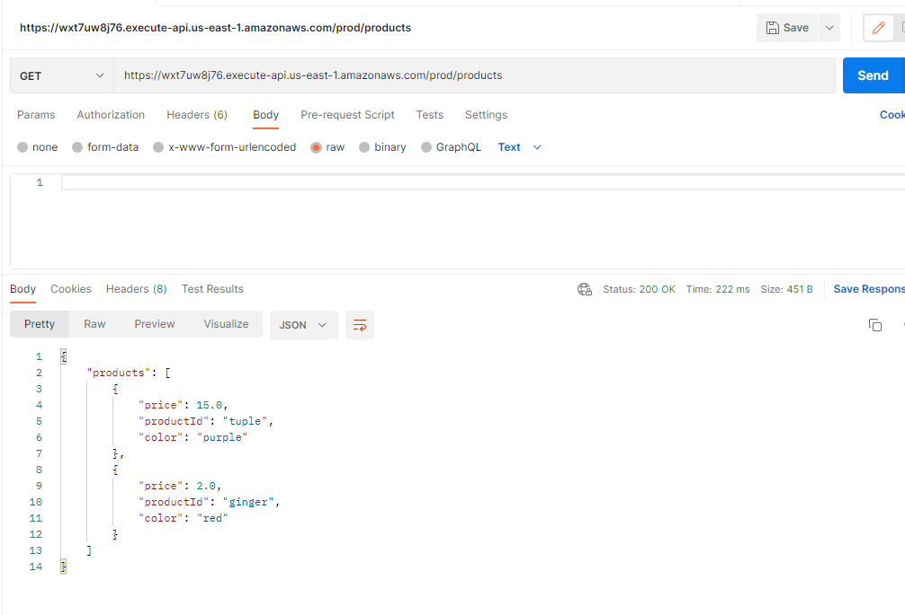


## Clean-up resources

```sh
aws dynamodb delete-table \
--table-name product-inventory
```

```sh
aws apigateway get-rest-apis
```

```sh
aws apigateway delete-rest-api --rest-api-id wxt7uw8j76
```

## Conclusion

In this project we builded a serverless api with an api gateway, a lambda function written in python. 
Hope you find it useful 🙋‍♀️